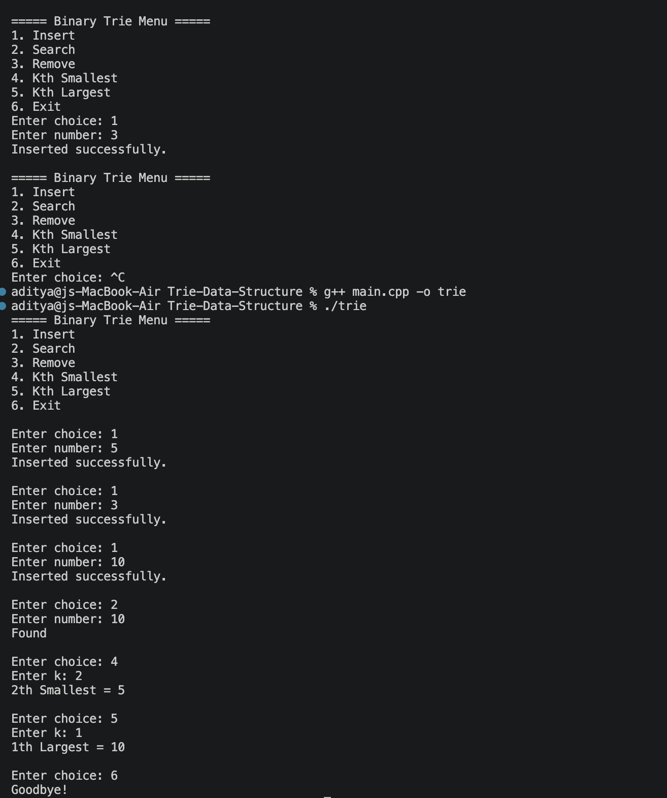

# Binary Trie Data Structure

A C++ implementation of a **Binary Trie** supporting efficient integer operations using **bitwise manipulation**. The project provides insertion, deletion, search, kth smallest, and kth largest queries with optimal time complexity for fixed-size integers.

---

## Features

- Insert integers
- Delete integers
- Search integers
- Find kth smallest element
- Find kth largest element
- Binary representation of integers
- Bitwise operations
- Pointer-based Trie implementation
- Menu-driven console application

---

## Demo

### Console Application



___

## Tech Stack

- C++
- Object-Oriented Programming
- Data Structures & Algorithms
- Bit Manipulation
- Pointers

---

## Project Structure

```
Trie-Data-Structure/
│── main.cpp
│── README.md
│── LICENSE
│── .gitignore
```

---

## Time Complexity

| Operation | Complexity |
|-----------|------------|
| Insert | O(32) |
| Delete | O(32) |
| Search | O(32) |
| kth Smallest | O(32) |
| kth Largest | O(32) |

Since integers contain 32 bits, every operation executes in constant time.

---

## How to Run

```bash
g++ main.cpp -o trie
./trie
```

---

## Concepts Used

- Binary Trie
- Bit Manipulation
- Binary Representation of Integers
- Dynamic Memory Allocation
- Pointer-based Trees
- Object-Oriented Programming

---

## Future Improvements

- Support 64-bit integers
- XOR Maximum/Minimum queries
- Prefix XOR queries
- Memory optimization
- File input/output support

---

## Author

**Aditya Singh**